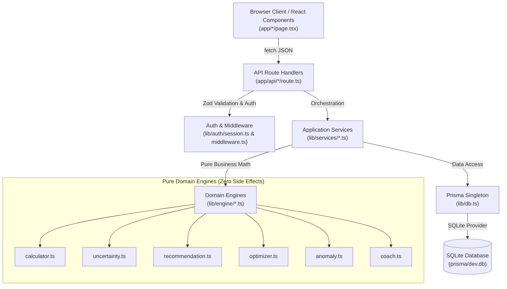
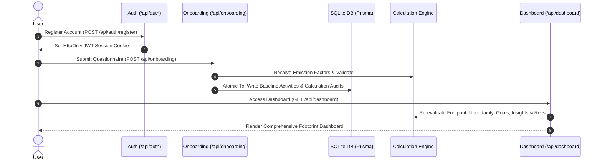
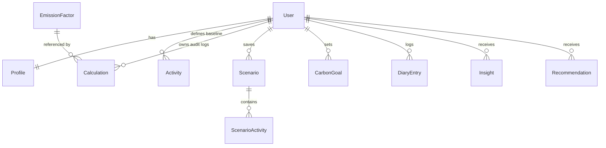

# offset.io — Personal Carbon Intelligence & Reduction Platform

[](https://nextjs.org/)
[](https://www.typescriptlang.org/)
[](https://www.prisma.io/)
[](https://tailwindcss.com/)
[](https://www.sqlite.org/)
[](https://vitest.dev/)
[](https://testsprite.com/)
[](#-license)

> **Measure → Understand → Simulate → Optimize → Track**

**offset.io** is a full-stack personal carbon-management platform built with **Next.js 14 (App Router)**, **TypeScript**, **Prisma ORM**, and **Tailwind CSS**. Unlike static quiz-style carbon calculators, **offset.io** maintains persistent activity models, performs transparent emission calculations backed by regional factor databases, computes quantitative confidence bounds, simulates hypothetical lifestyles, generates budget-constrained reduction plans, and tracks real-time progress with statistical anomaly detection.

---

## 📋 Table of Contents

- [Overview & Core Value](#overview--core-value)
- [✨ Key Features](#-key-features)
- [📐 Architecture & System Design](#-architecture--system-design)
- [🔄 User & Product Workflow](#-user--product-workflow)
- [🧠 Domain Engines Deep-Dive](#-domain-engines-deep-dive)
  - [1. Carbon Calculation Engine](#1-carbon-calculation-engine)
  - [2. Emission Factor & Cache System](#2-emission-factor--cache-system)
  - [3. Uncertainty & Confidence Scoring](#3-uncertainty--confidence-scoring)
  - [4. Recommendation Engine](#4-recommendation-engine)
  - [5. Bounded Greedy Knapsack Optimizer](#5-bounded-greedy-knapsack-optimizer)
  - [6. Z-Score Anomaly Detector](#6-z-score-anomaly-detector)
  - [7. Dual-Mode Carbon Coach](#7-dual-mode-carbon-coach)
- [📂 Directory Structure](#-directory-structure)
- [🚀 Quick Start & Local Setup](#-quick-start--local-setup)
- [🔐 Authentication & Security](#-authentication--security)
- [📡 Complete API Specification](#-complete-api-specification)
- [🗄️ Database Schema & Seeding](#️-database-schema--seeding)
- [⚙️ Environment Variables](#️-environment-variables)
- [🧪 Testing & Quality Assurance](#-testing--quality-assurance)
- [🛠️ Troubleshooting & FAQ](#️-troubleshooting--faq)
- [⚠️ Known Limitations](#️-known-limitations)
- [🗺️ Product Roadmap](#️-product-roadmap)
- [📄 License](#-license)

---

## Overview & Core Value

Most personal carbon footprint calculators rely on single-use, black-box questionnaires that return a static estimate. **offset.io** solves this transparency and actionability problem by:

1. **Storing Raw Activity Data**: Preserves granular user habits (travel distance, fuel types, energy usage, diet patterns, waste volumes) rather than unchangeable totals.
2. **Transparent Factor Lookup**: Computes emissions dynamically using database-driven, regionally calibrated factor lookup tables with full source attribution.
3. **Calculation Audit Trail**: Records step-by-step mathematical audit logs (formulas, exact emission factors used, confidence bounds, min/max ranges) for every activity.
4. **Honest Uncertainty Quantification**: Computes emissions-weighted confidence metrics (`HIGH` $\pm 5\%$, `MEDIUM` $\pm 15\%$, `LOW` $\pm 30\%$) instead of claiming exactness.
5. **Interactive What-If Simulation**: Enables side-by-side scenario comparisons without mutating active baseline data.
6. **Budget-Constrained Optimization**: Generates reduction plans prioritised by efficiency (greedy heuristic) using a knapsack algorithm constrained by monthly budget and reduction goals.
7. **Statistical Progress Tracking**: Detects abnormal emissions spikes using rolling sample $z$-score analysis over logged daily activity diaries.

---

## ✨ Key Features

| Feature | Description | Implementation Path |
|---|---|---|
| **Adaptive Onboarding** | 5-step baseline survey (incl. India region, zero values, exact-number inputs) with replace-warning + two-step confirm for returning users; writes persistent activities and atomic calculation audit records | [`app/onboarding/page.tsx`](app/onboarding/page.tsx), [`app/api/onboarding/route.ts`](app/api/onboarding/route.ts) |
| **Calculation Transparency** | Audit view showing input × factor = result, source links, region, methodology, and confidence ±% bands; distinct loading / signed-out / error / empty states | [`app/calculate/page.tsx`](app/calculate/page.tsx), [`lib/engine/calculator.ts`](lib/engine/calculator.ts) |
| **Emission Factor System** | 23 seeded regional emission factors with in-memory caching and fallback cascades | [`lib/services/emission-factor.service.ts`](lib/services/emission-factor.service.ts) |
| **Uncertainty Engine** | Emissions-weighted confidence score (0–100%) and min–max variance bounds, shown in plain language with the likely range | [`lib/engine/uncertainty.ts`](lib/engine/uncertainty.ts) |
| **What-If Simulator** | Hypothetical footprint re-calculation across 7 controls using the canonical diet values; visible error states (never silent); "Save as scenario" transfers current settings and "Use in my plan" prefills the plan target | [`app/simulator/page.tsx`](app/simulator/page.tsx), [`app/api/simulator/route.ts`](app/api/simulator/route.ts), [`lib/simulator-snapshot.ts`](lib/simulator-snapshot.ts) |
| **Scenario Manager** | Full CRUD workspace to save, edit, and compare scenarios; costs in profile currency; vs-goal column; simulator-snapshot import; two-click delete confirms | [`app/scenarios/page.tsx`](app/scenarios/page.tsx), [`app/api/scenarios/route.ts`](app/api/scenarios/route.ts) |
| **Greedy Optimizer** | Knapsack reduction plan builder prioritizing highest kg CO₂e reduced per money spent; profile-currency display; `?target=` prefill from simulator; unselected actions listed | [`lib/engine/optimizer.ts`](lib/engine/optimizer.ts), [`app/api/optimize/route.ts`](app/api/optimize/route.ts) |
| **Carbon Goals & Budget** | Single active goal lifecycle tracking progress %, reduction targets, and annual budgets, with visible save/error feedback | [`lib/services/goal.service.ts`](lib/services/goal.service.ts), [`app/api/goals/route.ts`](app/api/goals/route.ts) |
| **Daily Carbon Diary** | Daily log with dependent dropdowns (category → activity → type, unit auto-selected, only backend-priced combinations), live ≈kg estimate, and automatic $z$-score anomaly detection | [`app/diary/page.tsx`](app/diary/page.tsx), [`app/api/diary/route.ts`](app/api/diary/route.ts), [`lib/diary-options.ts`](lib/diary-options.ts), [`lib/engine/anomaly.ts`](lib/engine/anomaly.ts) |
| **Dual-Mode Coach** | Q&A assistant with deterministic offline rules (8 topic branches) and optional Groq LLM integration using `openai/gpt-oss-120b`; truthful greeting, visible error replies, `aria-live` conversation, preset questions mapped to real engine branches | [`lib/engine/coach.ts`](lib/engine/coach.ts), [`app/api/coach/route.ts`](app/api/coach/route.ts) |
| **Admin Factor Management** | Admin-restricted UI and API to add (with region + confidence selectors), inspect, and maintain emission factor tables; duplicate/conflict feedback | [`app/admin/page.tsx`](app/admin/page.tsx), [`app/api/admin/emission-factors/route.ts`](app/api/admin/emission-factors/route.ts) |
| **Profile Currency** | Single user currency (USD/EUR/GBP/INR) applied to every money figure via a central formatter — no hardcoded symbols | [`lib/format.ts`](lib/format.ts), [`app/profile/page.tsx`](app/profile/page.tsx) |
| **Google OAuth 2.0** | OpenID Connect "Continue with Google" login & signup, state token CSRF protection, account creation/linking, avatar photo sync, session management, and pre-hijacking protection (OAuth linking blocked for unverified password accounts) | [`lib/auth/google.ts`](lib/auth/google.ts), [`app/api/auth/google/route.ts`](app/api/auth/google/route.ts), [`components/GoogleSignInButton.tsx`](components/GoogleSignInButton.tsx) |
| **Human UI & Accessibility** | Plain-language navigation (Overview, Try changes, My plan, Daily log, …); proper labels, focus rings, `prefers-reduced-motion`, dialog semantics + Escape, contrast-fixed palette, `clamp()` fluid type, 44px touch targets | [`components/Navbar.tsx`](components/Navbar.tsx), [`components/Notice.tsx`](components/Notice.tsx), [`components/ConfirmButton.tsx`](components/ConfirmButton.tsx), [`app/globals.css`](app/globals.css) |

> [!NOTE]
> The UI shows real data or honest empty/loading/error states — never placeholder metrics. Failed requests are surfaced visibly and are never mistaken for "no data".

---

## 📐 Architecture & System Design

offset.io enforces a clean **Layered Architecture**. Domain calculation engines are pure, side-effect-free TypeScript modules located in [`lib/engine/`](lib/engine/) with zero dependencies on database ORMs or React UI frameworks.


```mermaid
graph TD
    Client["Browser Client / React Components<br/>(app/*/page.tsx)"] -->|fetch JSON| API["API Route Handlers<br/>(app/api/*/route.ts)"]
    API -->|Zod Validation & Auth| Auth["Auth & Middleware<br/>(lib/auth/session.ts & middleware.ts)"]
    API -->|Orchestration| Services["Application Services<br/>(lib/services/*.ts)"]
    Services -->|Pure Business Math| Engine["Domain Engines<br/>(lib/engine/*.ts)"]
    Services -->|Data Access| Prisma["Prisma Singleton<br/>(lib/db.ts)"]
    Prisma -->|SQLite Provider| DB[("SQLite Database<br/>(prisma/dev.db)")]

    subgraph "Pure Domain Engines (Zero Side Effects)"
        Engine --> Calc["calculator.ts"]
        Engine --> Uncert["uncertainty.ts"]
        Engine --> Recs["recommendation.ts"]
        Engine --> Opt["optimizer.ts"]
        Engine --> Anom["anomaly.ts"]
        Engine --> Coach["coach.ts"]
    end
```

---

## 🔄 User & Product Workflow


```mermaid
sequenceDiagram
    autonumber
    actor User
    participant Auth as Auth (/api/auth)
    participant Onboarding as Onboarding (/api/onboarding)
    participant DB as SQLite DB (Prisma)
    participant Engine as Calculation Engine
    participant Dash as Dashboard (/api/dashboard)

    User->>Auth: Register Account (POST /api/auth/register)
    Auth-->>User: Set HttpOnly JWT Session Cookie
    User->>Onboarding: Submit Questionnaire (POST /api/onboarding)
    Onboarding->>Engine: Resolve Emission Factors & Validate
    Onboarding->>DB: Atomic Tx: Write Baseline Activities & Calculation Audits
    User->>Dash: Access Dashboard (GET /api/dashboard)
    Dash->>Engine: Re-evaluate Footprint, Uncertainty, Goals, Insights & Recs
    Dash-->>User: Render Comprehensive Footprint Dashboard
```

---

## 🧠 Domain Engines Deep-Dive

### 1. Carbon Calculation Engine
Located in [`lib/engine/calculator.ts`](lib/engine/calculator.ts) & [`lib/services/footprint.service.ts`](lib/services/footprint.service.ts).

$$ \text{Annual Emissions (kg CO}_2\text{e)} = \text{Quantity} \times \text{Emission Factor} \times \text{Frequency Multiplier} $$

- **Frequency Multipliers**:
  - `DAILY` $\rightarrow 365$
  - `WEEKLY` $\rightarrow 52$
  - `MONTHLY` $\rightarrow 12$
  - `YEARLY` $\rightarrow 1$
- **Human-Readable Audit String**:
  ```text
  390 km/monthly × 0.192 kg CO2e/km × 12 multiplier = 898.56 kg CO2e/year
  ```

> [!IMPORTANT]
> The engine strictly fails with HTTP `422 EMISSION_FACTOR_NOT_FOUND` if a factor cannot be resolved. It never returns arbitrary placeholder calculations.

---

### 2. Emission Factor & Cache System
Located in [`lib/services/emission-factor.service.ts`](lib/services/emission-factor.service.ts).

- **Cascade Lookup Sequence**:
  1. Exact match on `category` + `activity` + `subtype` + `region` + `unit` (within `validFrom` / `validTo`).
  2. Fallback match with `region = 'GLOBAL'`.
  3. Throw `EmissionFactorNotFoundError`.
- **In-Memory Cache**: 5-minute TTL keyed by factor parameters, invalidated automatically when an admin creates a new factor via [`app/api/admin/emission-factors/route.ts`](app/api/admin/emission-factors/route.ts).

---

### 3. Uncertainty & Confidence Scoring
Located in [`lib/engine/uncertainty.ts`](lib/engine/uncertainty.ts).

- **Confidence Bands & Margins**:
  - `HIGH`: Margin $\pm 5\%$, Score $90$
  - `MEDIUM`: Margin $\pm 15\%$, Score $70$
  - `LOW`: Margin $\pm 30\%$, Score $40$
- **Weighted Footprint Confidence Score**:

$$ \text{Weighted Score} = \frac{\sum (\text{Activity Emissions}_i \times \text{Score}_i)}{\sum \text{Activity Emissions}_i} $$

- **Classification**:
  - Score $\ge 80 \rightarrow$ **HIGH** confidence
  - Score $< 60 \rightarrow$ **LOW** confidence
  - Otherwise $\rightarrow$ **MEDIUM** confidence

---

### 4. Recommendation Engine
Located in [`lib/engine/recommendation.ts`](lib/engine/recommendation.ts).

Contains 7 deterministic rules evaluated against the computed footprint:

| Rule Key | Trigger Condition | Est. Reduction | Monthly Cost | Difficulty |
|---|---|---|---|---|
| `TRANSIT_COMMUTE` | Car emissions $> 300\text{ kg/yr}$ | 40% of car emissions | $+\$20$ | EASY |
| `SWITCH_EV` | Car exists & subtype $\neq$ `ev` | 72% of car emissions | $+\$120$ | HARD |
| `RAIL_TRAVEL` | Flight emissions $> 200\text{ kg/yr}$ | 80% of flight emissions | $\$0$ | MEDIUM |
| `SOLAR_PANELS` | Electricity exists & subtype $\neq$ `solar` | 85% of electricity | $+\$35$ | MEDIUM |
| `LED_THERMOSTAT` | Electricity exists & subtype $\neq$ `solar` | 15% of electricity | $+\$10$ | EASY |
| `PLANT_DIET` | Diet exists & subtype $\neq$ `plant_based` | 45% (High Meat) / 32% (Mixed) | $-\$30$ (Savings) | EASY |
| `COMPOST_RECYCLE` | Waste exists with `landfill` subtype | 65% of waste emissions | $+\$5$ | EASY |

---

### 5. Bounded Greedy Knapsack Optimizer
Located in [`lib/engine/optimizer.ts`](lib/engine/optimizer.ts).

Generates actionable reduction plans under target constraints:

1. **Efficiency Metric**:
   $$ \text{Efficiency} = \frac{\text{Annual Reduction (kg CO}_2\text{e)}}{\max(0.01, \text{Monthly Cost (\$)} )} $$
2. **Greedy Selection**: Sorts non-forbidden actions by efficiency descending and selects actions until the target reduction percentage or `maxMonthlyBudget` is satisfied.

> [!TIP]
> Money-saving recommendations (negative monthly cost) have an effective cost of $\$0.01$, ensuring financial savings are prioritized first.

---

### 6. Z-Score Anomaly Detector
Located in [`lib/engine/anomaly.ts`](lib/engine/anomaly.ts).

Identifies unusual daily diary logging spikes:

$$ z = \frac{x - \mu}{\sigma} $$

- Threshold: $z \ge 2.0$ (minimum sample size $n \ge 3$).
- Surfaces warnings on the Carbon Diary, Dashboard Insights feed, and Carbon Coach context payload.

---

### 7. Dual-Mode Carbon Coach
Located in [`lib/engine/coach.ts`](lib/engine/coach.ts).

- **Local Mode (Default)**: Zero external calls. Uses deterministic keyword parser over real user footprint numbers, with 8 topic branches covering largest source, target gap, priority ordering, daily/monthly averages, confidence ranges, scenarios, anomalies, and a context-aware generic fallback.
- **Groq Mode (`COACH_MODE=groq`)**: Connects via HTTPS `fetch` to Groq's OpenAI-compatible API using `openai/gpt-oss-120b`.
- **Silent Fallback**: Automatically reverts to local deterministic mode if the API key is missing, network requests fail, or the model returns an invalid response.

---

## 📂 Directory Structure

```text
offset.io/
├── app/                    # Next.js 14 App Router Pages & API Routes
│   ├── admin/              # Emission factor management UI (ADMIN role required)
│   ├── api/                # 16 REST API endpoints (auth, onboarding, dashboard, scenarios, etc.)
│   ├── calculate/          # Audit transparency & calculation breakdown view
│   ├── coach/              # Interactive Carbon Coach chat UI
│   ├── dashboard/          # Footprint summary, breakdown charts & live advice
│   ├── diary/              # Carbon diary logging & anomaly visualization
│   ├── goals/              # Carbon budget and goal setting UI
│   ├── insights/           # Live generated insights & activity flags
│   ├── onboarding/         # Baseline questionnaire multi-step flow
│   ├── reduction-plan/     # Optimization plan generator UI
│   ├── scenarios/          # Save, edit, and compare scenario UI
│   └── simulator/          # What-If interactive slider page
├── components/             # Shared UI components (Navbar, Footer, ThemeToggle, Notice, ConfirmButton)
├── features/               # Typed front-end clients & React hooks
│   ├── dashboard/          # Dashboard API hooks and types
│   └── simulator/          # Simulator API hooks and types
├── lib/                    # Core Business Logic & Orchestration
│   ├── auth/               # JWT token creation & session guard helpers
│   ├── dashboard-state.ts  # Dashboard fetch-state classifier (loading/unauthorized/error/empty/ready)
│   ├── diary-options.ts    # Diary catalog: only backend-priced combos + preview factors + legacy labels
│   ├── diet-options.ts     # Canonical diet values shared by onboarding & simulator
│   ├── db.ts               # Prisma Client singleton
│   ├── engine/             # Side-effect-free pure mathematical domain engines
│   ├── format.ts           # Central currency/number formatting (profile-driven, no hardcoded symbols)
│   ├── services/           # DB orchestration, factor caching, and goal workflows
│   └── simulator-snapshot.ts # Simulator → scenarios handoff (validated localStorage snapshot)
├── prisma/
│   ├── schema.prisma       # 11 Relational Database Models
│   ├── migrations/         # SQLite SQL migration files
│   └── seed.ts             # Seed script (23 factors, 2 demo users, baseline activities)
├── tests/                  # Vitest unit & integration test suites (run npm test for current count)
└── vitest.config.ts        # Vitest test configuration
```

---

## 🚀 Quick Start & Local Setup

### Prerequisites
- **Node.js**: $\ge 18.17.0$ (Node 20 LTS recommended)
- **npm**: $\ge 9.0.0$

### Setup Instructions

```bash
# 1. Clone the repository
git clone https://github.com/your-username/offset.io.git
cd offset.io

# 2. Install dependencies
npm install

# 3. Configure environment variables
cp .env.example .env
```

Edit your `.env` file to set a secure secret:
```env
DATABASE_URL="file:./dev.db"
JWT_SECRET="your-super-secret-random-key-here"
COACH_MODE="local"
```

```bash
# 4. Bootstrap and seed the database
npm run db:setup

# 5. Launch the development server
npm run dev
```

Open [http://localhost:3000](http://localhost:3000) in your browser.

> [!NOTE]
> Demo accounts are seeded in development only. Run `npm run db:seed` and check the console output for credentials.

---

## 🔐 Authentication & Security

- **Authentication Primitive**: JSON Web Tokens (JWT) signed via [`jose`](lib/auth/jwt.ts) using `HS256`.
- **Google OAuth 2.0 / OIDC**: Official OpenID Connect authorization code flow ([`lib/auth/google.ts`](lib/auth/google.ts)) with cryptographic CSRF state token verification (`offset_oauth_state` HTTP-only cookie), automatic account linking by email, pre-hijacking protection (OAuth linking blocked when `emailVerified=false`), user photo avatar syncing, and zero password storage.
- **Email Verification Flag**: `emailVerified` field on the `User` model. OAuth signups set it `true` automatically; password signups default to `false`. OAuth cannot link to an unverified password account.
- **Session Transport**: Stored in `offset_session` cookie marked `HttpOnly`, `SameSite=lax`, with `Secure` flag enabled in production.
- **Password Security**: Passwords hashed with [`bcryptjs`](app/api/auth/register/route.ts) (10 salt rounds) for standard email credentials.
- **Route Protection**: [`middleware.ts`](middleware.ts) protects application routes while API endpoints enforce double verification via `requireAuth()` and `requireAdmin()`.

---

## 📡 Complete API Specification

All API endpoints return JSON. Mutating endpoints validate payloads with **Zod** schemas.

| Method | Endpoint | Auth | Description | Payload / Response |
|---|---|---|---|---|
| `POST` | `/api/auth/register` | Public | Create account & profile | In: `{ name, email, password, region? }` |
| `POST` | `/api/auth/login` | Public | Authenticate user & issue JWT cookie | In: `{ email, password }` |
| `GET` | `/api/auth/google` | Public | Initiate Google OAuth authorization flow | Redirects to Google consent screen |
| `GET` | `/api/auth/google/callback` | Public | Handle Google OAuth callback & issue session | In: `?code=...&state=...` |
| `POST` | `/api/auth/logout` | Session | Clear session cookie | Out: `{ success: true }` |
| `GET` | `/api/auth/me` | Session | Retrieve current authenticated user profile | Out: `{ authenticated: true, user }` |
| `POST` | `/api/onboarding` | Required | Set baseline questionnaire & generate audit logs | In: Onboarding survey options |
| `GET` | `/api/dashboard` | Required | Aggregated footprint, uncertainty, goals, insights | Out: Comprehensive dashboard payload |
| `POST` | `/api/simulator` | Required | Run What-If simulation against baseline | In: Slider configuration values |
| `GET` | `/api/scenarios` | Required | List user saved scenarios | Out: List of scenario objects |
| `POST` | `/api/scenarios` | Required | Create and calculate a saved scenario | In: `{ name, activities, costDelta }` |
| `PATCH` | `/api/scenarios?id=<id>` | Required | Partial update scenario activities | In: Modified scenario payload |
| `DELETE`| `/api/scenarios?id=<id>` | Required | Delete scenario by ID | Out: `{ success: true }` |
| `POST` | `/api/optimize` | Required | Generate knapsack reduction plan | In: `{ targetReductionPct, maxMonthlyBudget }` |
| `GET` | `/api/goals` | Required | Fetch current active goal | Out: Active goal object |
| `POST` | `/api/goals` | Required | Atomically replace active carbon goal | In: `{ targetAnnualEmissionsKg, targetYear }` |
| `GET` | `/api/diary` | Required | Retrieve diary entries with $z$-score flags | Out: `{ entries, anomalyResult }` |
| `POST` | `/api/diary` | Required | Log daily activity entry (server resolves factor from category/activity/subtype/unit) | In: `{ date, category, activityType, subtype, quantity, unit, notes? }` |
| `POST` | `/api/coach` | Required | Ask question to Carbon Coach | In: `{ query: string }` |
| `GET` | `/api/admin/emission-factors` | Admin | List full emission factor table | Out: `{ factors: [] }` |
| `POST` | `/api/admin/emission-factors` | Admin | Add new factor to database & clear cache | In: Emission factor schema |

---

## 🗄️ Database Schema & Seeding

The application uses **SQLite** backed by Prisma.


```mermaid
erDiagram
    User ||--|| Profile : "has"
    User ||--o{ Activity : "defines baseline"
    User ||--o{ Calculation : "owns audit logs"
    User ||--o{ Scenario : "saves"
    Scenario ||--o{ ScenarioActivity : "contains"
    User ||--o{ CarbonGoal : "sets"
    User ||--o{ DiaryEntry : "logs"
    User ||--o{ Insight : "receives"
    User ||--o{ Recommendation : "receives"
    EmissionFactor ||--o{ Calculation : "referenced by"
```

- **11 Schema Models**: `User` (with `emailVerified` flag), `Profile`, `EmissionFactor`, `Activity`, `Calculation`, `Scenario`, `ScenarioActivity`, `Recommendation`, `CarbonGoal`, `DiaryEntry`, `Insight`.
- **Deterministic Seed**: Executing `npm run db:seed` wipes and re-populates 23 emission factors, 2 users, baseline activities, saved scenarios, 30 diary entries, and demo goals.

---

## ⚙️ Environment Variables

| Variable | Required | Default | Description |
|---|---|---|---|
| `DATABASE_URL` | **Yes** | `"file:./dev.db"` | SQLite database connection string |
| `JWT_SECRET` | **Production** | Dev Fallback | Secret key used for signing session JWTs |
| `GOOGLE_CLIENT_ID` | Google OAuth | `""` | OAuth 2.0 Client ID from Google Cloud Console |
| `GOOGLE_CLIENT_SECRET` | Google OAuth | `""` | OAuth 2.0 Client Secret from Google Cloud Console |
| `GOOGLE_REDIRECT_URI` | Google OAuth | `"http://localhost:3000/api/auth/google/callback"` | OAuth callback URI |
| `NODE_ENV` | No | `"development"` | Environment flag (`development` \| `production`) |
| `COACH_MODE` | No | `"local"` | Coach execution engine (`local` \| `groq`) |
| `GROQ_API_KEY` | Groq Mode | `""` | API key required when `COACH_MODE=groq` |

---

## 🧪 Testing & Quality Assurance

The codebase features comprehensive Vitest test suites covering unit domain logic, integration workflows, Google OAuth flows, and shared UI-support libraries, alongside a TestSprite E2E suite covering all core user flows.

```bash
# Run unit and integration tests once
npm test

# Run tests in watch mode
npm run test:watch
```

### Unit & Integration Test Suites (Vitest — 23 suites, 100 tests)
1. [`tests/google-auth.test.ts`](tests/google-auth.test.ts) — Google OAuth utilities, CSRF state verification, authorization URL builder, user signup/login, account linking, pre-hijacking protection
2. [`tests/calculator.test.ts`](tests/calculator.test.ts) — Annualization formula & category aggregation
3. [`tests/uncertainty.test.ts`](tests/uncertainty.test.ts) — Confidence score weighting & min/max bounds
4. [`tests/optimizer.test.ts`](tests/optimizer.test.ts) — Greedy knapsack budget optimization
5. [`tests/anomaly.test.ts`](tests/anomaly.test.ts) — Z-score spike detector thresholds
6. [`tests/anomaly-insights.test.ts`](tests/anomaly-insights.test.ts) — Anomaly insight generation
7. [`tests/coach.test.ts`](tests/coach.test.ts) — Local deterministic Q&A logic & Groq fallback
8. [`tests/emission-factor.service.test.ts`](tests/emission-factor.service.test.ts) — Factor lookup cascade & caching
9. [`tests/footprint.service.test.ts`](tests/footprint.service.test.ts) — DB footprint aggregation
10. [`tests/scenario-crud.test.ts`](tests/scenario-crud.test.ts) — Scenario persistence & user isolation
11. [`tests/diary-crud.test.ts`](tests/diary-crud.test.ts) — Diary CRUD & anomaly evaluation
12. [`tests/goal-lifecycle.test.ts`](tests/goal-lifecycle.test.ts) — Atomic active goal replacement
13. [`tests/onboarding-transaction.test.ts`](tests/onboarding-transaction.test.ts) — Questionnaire atomic transaction
14. [`tests/dashboard-idempotency.test.ts`](tests/dashboard-idempotency.test.ts) — Read-only dashboard safety
15. [`tests/simulator.test.ts`](tests/simulator.test.ts) — What-If parameter recalculation
16. [`tests/middleware.test.ts`](tests/middleware.test.ts) — Route protection & auth redirects
17. [`tests/format.test.ts`](tests/format.test.ts) — Profile-currency formatting & signed monthly deltas
18. [`tests/diary-options.test.ts`](tests/diary-options.test.ts) — Diary catalog validity, canonical diet values, legacy labels
19. [`tests/ux-state.test.ts`](tests/ux-state.test.ts) — Dashboard state classification & simulator-snapshot validation/mapping
20. [`tests/email-verification.test.ts`](tests/email-verification.test.ts) — `emailVerified` flag on password vs. OAuth signups, pre-hijacking block
21. [`tests/ev-reduction.test.ts`](tests/ev-reduction.test.ts) — Regional EV emission reduction calculations (India, US, EU)
22. [`tests/route-handlers.test.ts`](tests/route-handlers.test.ts) — Import smoke tests for API route handlers
23. [`tests/category-aggregation.test.ts`](tests/category-aggregation.test.ts) — Footprint category breakdown aggregation

### E2E Test Suite (TestSprite — 8 tests)

End-to-end browser tests run against the live local server via TestSprite. Plans are stored in [`testsprite-plans/`](testsprite-plans/).

| Test | Flow |
|---|---|
| User registration → onboarding redirect | New user signup & profile creation |
| Email/password login → dashboard | Authentication & session |
| Login with wrong password shows error | Auth error handling |
| Full 5-step onboarding flow | Baseline questionnaire |
| Dashboard breakdown + recommendations | Footprint overview |
| Diary: log an activity entry | Daily log submission |
| Goals: set and save a yearly target | Goal lifecycle |
| Carbon coach: preset question → response | Coach Q&A |

```bash
# Run all E2E tests (requires dev server on :3000 and TestSprite CLI)
testsprite test run --all --project 028350e3-7c1b-4fc7-acc4-7d4a64765b58 --local 3000 --wait
```

---

## 🛠️ Troubleshooting & FAQ

| Problem | Root Cause | Solution |
|---|---|---|
| `JWT_SECRET required in production` | Booting in `NODE_ENV=production` without secret | Set `JWT_SECRET` in `.env` or deployment environment |
| `422 EMISSION_FACTOR_NOT_FOUND` | Missing emission factor for requested activity | Add factor via `/admin` UI or run `npm run db:seed` |
| `403 FORBIDDEN` on Admin UI | Authenticated user lacks `ADMIN` role | Log in with administrator account (`admin@offset.io`) |
| Prisma database file error | Database not created or schema altered | Run `npm run db:setup` to reset schema and seed |
| Redirect loop to `/auth/login` | Stale or invalid `offset_session` cookie | Clear browser cookies and re-authenticate |

---

## ⚠️ Known Limitations

1. **SQLite Storage**: Uses single-file SQLite database for local execution simplicity.
2. **Single Migration File**: Baseline schema managed via initial migration (`0001_initial`).
3. **Admin Factor Operations**: Factor management currently supports List + Create endpoints (no Edit/Delete API).
4. **Onboarding Replaces Baseline**: Re-running onboarding still replaces (rather than merges) activity records — it now warns and requires a two-step confirm first. Scenarios, goals, and diary entries are preserved.
5. **Diary Resolves Regional Factors**: The diary API resolves factors by the user's profile region with a GLOBAL fallback.
6. **Simulator Excludes Consumption**: Clothing/electronics factors exist and are loggable in the diary, but onboarding and the simulator never create `CONSUMPTION` activities and no recommendation rule targets them.
7. **Optimizer Explanation Currency**: The optimizer engine's explanation sentence uses `$` while all UI money figures use the profile currency (`lib/format.ts`).
8. **Secure Cookies Need HTTPS**: The session cookie is `Secure` in production, so authenticated API testing over plain `http://localhost` requires `NODE_ENV=development` (the dev server default).
9. **No E2E Browser Tests**: Testing pipeline utilizes Vitest node integration testing (no Cypress/Playwright).
10. **No Password Reset**: Password reset functionality is not implemented. Users must contact support or create a new account.
11. **No Email Verification for Password Signups**: Password-based accounts are created without email verification. OAuth linking is blocked for unverified accounts to prevent pre-hijacking.
12. **JWT Tokens Cannot Be Revoked**: JWTs are valid for 7 days and cannot be revoked before expiry. Signing out only clears the client-side cookie.

---

## 🚀 Deployment

**Warning:** SQLite and the in-memory emission factor cache are per-process. Do not deploy to serverless platforms (AWS Lambda, Vercel, Netlify Functions) or multi-instance hosts without switching to PostgreSQL and implementing a shared cache (Redis, Memcached).

**Minimum deployment:** Single VPS or Docker container with a named volume for `dev.db`.

**Production checklist:**
- Set `JWT_SECRET` environment variable (generate with `openssl rand -base64 32`)
- Set `NODE_ENV=production`
- Ensure cookies are served over HTTPS (`Secure` flag enabled automatically)
- Never set `ALLOW_DESTRUCTIVE_SEED=true` in production
- Backup `dev.db` regularly

---

## 🗺️ Product Roadmap

- [x] Baseline Carbon Footprint Calculation & Audit Trail
- [x] Database-backed Regional Emission Factors & In-Memory Caching
- [x] Quantitative Uncertainty & Confidence Scoring Model
- [x] Side-by-side What-If Simulator & Saved Scenario Manager
- [x] Constrained Greedy Knapsack Reduction Plan Optimizer
- [x] Daily Carbon Diary with Rolling Z-Score Anomaly Detection
- [x] Dual-Mode Carbon Coach (Local Offline + Groq LLM integration via `openai/gpt-oss-120b`)
- [x] Trust & Usability Pass: honest empty/loading/error states (no placeholder metrics), plain-language navigation, diary dropdowns with live estimates, profile-driven currency everywhere, simulator → scenario/plan handoffs, delete confirmations, visible mutation feedback, accessibility baseline (labels, focus rings, reduced motion, dialog semantics, contrast, fluid type)
- [x] OAuth Pre-Hijacking Protection (`emailVerified` flag, OAuth linking blocked for unverified accounts)
- [x] E2E Browser Test Suite (TestSprite — 8 tests covering all core user flows)
- [ ] Admin Factor Edit & Deactivation Capabilities
- [ ] Multi-tenant PostgreSQL Database Driver Support
- [ ] Persisted reduction plans linked to goals with re-evaluation
- [ ] Simulator cost modeling and CONSUMPTION coverage

---

## 📄 License

This repository does not contain an open-source license file. All rights are reserved by default. Unauthorized copying, modification, or distribution is prohibited.
